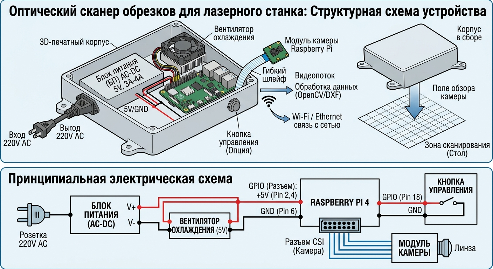

# Оптический сканер обрезков листовых материалов для лазерного станка Smart Laser Cut

### 1. Менторы
* **Тавитов Азамат Георгиевич** 

---

### 2. Команда
* **Веритэ Филипп Артемович**, Б01-505, `@reynel_jenkins`

---

### 3. Цель проекта
Создать компактный автономный модуль на базе **Raspberry Pi 4**, встроенной камеры и 3D-печатного корпуса, предназначенный для фотофиксации и геометрического сканирования деловых обрезков (остатков) листовых материалов после лазерной резки с целью их последующего повторного использования.

---

### 4. Описание функционала

* **Аппаратная платформа:** Raspberry Pi 4 Model B (2 ГБ / 4 ГБ RAM) + Raspberry Pi Camera Module (или USB-камера высокого разрешения).
* **Питание:** Импульсный блок питания (5V / 3A–4A) с защитой от перепадов напряжения и сетевых помех промышленного оборудования.
* **Конструктив:** Защитный 3D-печатный корпус с жестким кронштейном крепления над рабочим столом/зоной сканирования и рассеивающим подсветку диффузором.
* **Зона сканирования:** Фиксированная рабочая область (например, $500 \times 500$ мм или $1000 \times 1000$ мм в зависимости от высоты подвеса).
* **Принцип работы:** 
  1. Оператор кладет обрезок листа в зону сканирования.
  2. Камера делает снимок высокого разрешения по нажатию физической кнопки или через веб-интерфейс.
  3. Алгоритм компьютерного зрения (**OpenCV**) компенсирует оптические искажения (дисторсию линзы) и перспективу, определяет внешние и внутренние контуры обрезка и переводит их в векторный формат (**DXF/SVG**) с сохранением реального масштаба.
  4. Полученный векторный контур передается в базу данных или систему нестинга (подготовки реза).

---

### 5. Задачи проекта

1. **Расчет геометрических параметров:** Определение фокусного расстояния камеры, высоты установки ($H$) относительно стола и угла обзора (FOV) для полного охвата зоны сканирования без потери точности (разрешение $\le 1$ мм/пиксель).
2. **Подбор и расчёт питания:** Подбор надежного БП (5V, $\ge 3\text{A}$), кабелей питания с минимальным падением напряжения и компонентов системы защиты.
3. **Разработка CAD-модели корпуса:** Проектирование защитного корпуса под Raspberry Pi 4, камеру и БП с учетом охлаждения процессорного блока и регулировки угла наклона камеры.
4. **3D-печать и сборка:** Изготовление корпуса, монтаж компонентов, укладка кабелей и установка системы над сканируемой поверхностью.
5. **Программирование и калибровка:**
   * Настройка ОС Raspberry Pi OS (headless/с веб-интерфейсом).
   * Написание скрипта калибровки камеры по шахматной доске (ChArUco / Chessboard) для устранения дисторсии.
   * Написание алгоритма выделения контуров на базе OpenCV и экспорта в DXF/SVG.
6. **Тестирование:** Оценка точности восстановленных контуров на реальных фанерных/металлических обрезках различной формы.

---

### 6. Анализ существующих аналогов

#### 1. Промышленные встроенные системы нестинга (Bystronic / Trumpf / OpenCascade)
* **Описание:** Камеры высокого разрешения, интегрированные непосредственно в станину лазерного комплекса с заводским ПО.
* **Плюсы:** Высочайшая точность, интеграция с ЧПУ станка «из коробки».
* **Минусы:** Экстремально высокая стоимость, закрытая экосистема, невозможность установки на бюджетные/DIY станко-места.

#### 2. Open-source проекты на базе OpenCV и веб-камер (OpenPnP / SheetCam plugins)
* **Описание:** Использование обычной USB-камеры, подключенной к ПК, с обработкой снимков через сторонний софт.
* **Плюсы:** Дешевизна, простота начальной настройки.
* **Минусы:** Требуется постоянно подключенный ПК, провисание USB-кабелей, нестойкость дешевых веб-камер к промышленным помехам, отсутствие готового автономного устройства.

#### Сравнение с разрабатываемым проектом:
Наш проект представляет собой **полностью автономное Smart-устройство (Edge Device)**. Все вычисления (устранение дисторсии, распознавание контуров, генерация DXF) происходят прямо на Raspberry Pi 4. Устройство не требует постоянного подключения к ПК и передает уже готовые DXF/SVG файлы по Wi-Fi/Ethernet в базу данных предприятия или в веб-интерфейс оператора.

---

### 7. Схемы устройства и электропитания

#### Описание схемы подключений:
1. Сетевое напряжение 220V AC подается на блок питания (AC-DC 220V $\rightarrow$ 5V 4A).
2. Выход 5V DC от БП подключается к Raspberry Pi 4 через контакты GPIO (Pin 2,4: +5V, Pin 6: GND).
3. Камера подключается к Raspberry Pi через плоский гибкий шлейф MIPI CSI.
4. В корпус встроен вентилятор охлаждения 5V (подключен параллельно к шине питания 5V и GND).
5. Кнопка захвата кадра подключена к GPIO Pin 18 с заземлением на GND (Pin 6).
